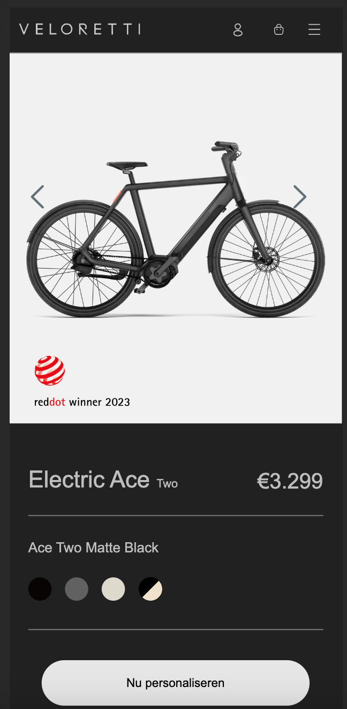

# Procesverslag
Markdown is een simpele manier om HTML te schrijven.  
Markdown cheat cheet: [Hulp bij het schrijven van Markdown](https://github.com/adam-p/markdown-here/wiki/Markdown-Cheatsheet).

Nb. De standaardstructuur en de spartaanse opmaak van de README.md zijn helemaal prima. Het gaat om de inhoud van je procesverslag. Besteedt de tijd voor pracht en praal aan je website.

Nb. Door *open* toe te voegen aan een *details* element kun je deze standaard open zetten. Fijn om dat steeds voor de relevante stuk(ken) te doen.

## Jij

uitwerken voor kick-off werkgroep

### Auteur:
Maeren Griffioen

#### Je startniveau:
Blauw

#### Je focus:
Surface Plane
 

## Je website

uitwerken voor kick-off werkgroep

### Je opdracht:
https://www.veloretti.com/nl

#### Screenshot(s) van de eerste pagina (small screen): 
Ace Two

#### Screenshot(s) van de tweede pagina (small screen):
Login/sign up 

 

## Breakdownschets (week 1)

uitwerken na afloop 2e werkgroep

### de hele pagina: 

### dynamisch deel (bijv menu): 

### wellicht nog een dynamisch deel (bijv filter): 

## Voortgang 1 (week 2)

uitwerken voor 1e voortgang

### Stand van zaken
hier dit ging goed & dit was lastig (neem ook screenshots op van delen van je website en code)

### Agenda voor meeting
samen met je groepje opstellen

Bente: vragen over toegankelijkheid, en formaat van foto's   
Jamie: laten kijken naar HTML, nog een ander vraagje 
Maeren: laten kijken naar html, buttons in een ul andere stijl maken 
Sanne: paar vraagjes over html 
Tim: vragen over html en css, vragen over de opbouw van html en css

### Verslag van meeting
hier na afloop snel de uitkomsten van de meeting vastleggen

- Mijn vragen zijn beantwoord en ik snap mijn code een stukje beter.
- Ik kreeg te horen dat ik flink aan de bak moet, omdat ik nog niet zover ben.

## Voortgang 2 (week 3)

uitwerken voor 2e voortgang

### Stand van zaken
hier dit ging goed & dit was lastig (neem ook screenshots op van delen van je website en code)

### Agenda voor meeting
samen met je groepje opstellen

Bente: vragen over responsive, nav en uitklap menu, grid voor foto galerij
Stella: vragen over hamburger menu 
Maeren: vragen over hamburger menu en nog wat andere kleine dingetjes met code en of ik gedownload font op de site kan zetten 
Tim: vragen over hamburger menu

### Verslag van meeting
hier na afloop snel de uitkomsten van de meeting vastleggen

- Kleine foutjes zijn opgelost
- hamburger menu moet nog gedaan worden
- mijn website ziet er al prima uit

## Toegankelijkheidstest (week 4)

uitwerken na test in 8e voortgang

### Bevindingen
Lijst met je bevindingen die in de test naar voren kwamen:

#### Ik was een heel eind
Ik had nog een paar kleine dingetjes die aangepast moesten worden.

Ik heb mijn html nog niet gevalideert, sommige focus states werken niet, ik moet nog eigen hover en focus states toevoegen en darkmode heb ik niet.

Deze heb ik inmiddels opgelost. De validatie bracht een paar kleine foutjes naar voren. Focus states zijn gefixt. eigen hover en focus states zijn toegevoegd. Darkmode is na veel werk toegevoegd en werken op de hele html inclusief iconen.

## Voortgang 3 (week 4)

uitwerken voor 3e voortgang

### Stand van zaken
hier dit ging goed & dit was lastig (neem ook screenshots op van delen van je website en code)

### Agenda voor meeting
samen met je groepje opstellen

Bente: vragen over footer, responsive, javascript en nog paar kleine dinge op website.   
Maeren: Ik heb een paar kleine vraagjes maar hier kom ik zelf wel uit. 
Sanne: vraag over img in de h1 
Tim: vragen over responsive en nog laatste check van mn hele website en de responsive state.

### Verslag van meeting
hier na afloop snel de uitkomsten van de meeting vastleggen

- NVT

## Eindgesprek (week 5)

uitwerken voor eindgesprek

### Stand van zaken
hier dit ging goed & dit was lastig (neem ook screenshots op van delen van je website en code)

### Screenshot(s)

## Bronnenlijst

continu bijhouden terwijl je werkt

Nb. Wees specifiek ('css-tricks' als bron is bijv. niet specifiek genoeg).

1. https://chat.openai.com/
2. https://stackoverflow.com/
3. https://www.google.nl/
4. https://www.w3schools.com/
5. https://codepen.io/shooft/pen/LYMEWVm
6. https://www.youtube.com/
7. https://flexboxfroggy.com/#nl
8. https://stackoverflow.com/questions/69794168/why-does-my-hamburger-menu-didnt-work-on-other-page
9. https://stackoverflow.com/questions/31402576/enable-focus-only-on-keyboard-use-or-tab-press
10. https://stackoverflow.com/questions/6518218/html-5-section-aside-margin-problem
11. https://imagecolorpicker.com/
12. https://www.ilikesticker.com/LineStickerAnimation/W3927035-Cat-Laser-Beam/en
13. https://stackoverflow.com/questions/37183114/how-to-style-text-of-submit-button
14. https://stackoverflow.com/questions/885691/how-to-make-a-ul-display-in-a-horizontal-row
15. https://stackoverflow.com/questions/44146881/my-width-is-bigger-than-my-screen-but-body-and-html-are-set-to-0-padding-and-ma
16. https://stackoverflow.com/questions/48474/how-do-i-position-one-image-on-top-of-another-in-html
17. https://cubic-bezier.com/#.32,-0.34,.72,.81
18. https://www.w3schools.com/html/html_forms.asp
19. 

